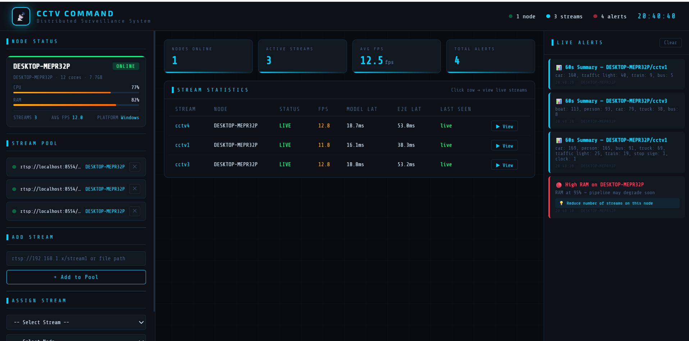

# Real-Time Distributed Human Activity Recognition CCTV Monitoring System

A high-performance, scalable CCTV monitoring system designed for real-time multi-stream Human Activity detection using YOLOv8 and OpenVINO on CPU. The system enables edge nodes to auto-register with a central server, facilitating seamless deployment and management without manual configuration.

## Table of Contents

- [Project Overview](#project-overview)
- [What It Does](#what-it-does)
- [How It Works](#how-it-works)          
- [Benchmark Results](#benchmark-results)
- [Architecture](#architecture)
- [Folder Structure](#folder-structure)
- [Installation](#installation)
- [Usage](#usage)
- [Dashboard Interface](#dashboard-interface)
- [Advantages](#advantages)
- [License](#license)

---

## Project Overview

This project implements a distributed CCTV monitoring system comprising two primary components: a central server with a web-based dashboard and lightweight edge agents deployed on CCTV nodes. The system leverages advanced computer vision models to perform real-time object detection across multiple video streams, ensuring efficient resource utilization and scalability.

## What It Does

The Real-Time Distributed CCTV Monitoring System provides:

- **Real-Time Activity Detection**: Processes multiple video streams simultaneously using YOLOv8 and behaviour file for detect (Walking, Sitting, Standing, Runnning).
- **Distributed Architecture**: Centralizes control while distributing computation to edge nodes for optimal performance.
- **Automated Node Management**: Edge agents auto-register with the central server, eliminating manual setup.
- **Live Monitoring Dashboard**: Offers a web interface for overseeing node status, stream assignments, and performance metrics.
- **Performance Tracking**: Monitors and reports CPU usage, RAM consumption, FPS, and latency in real-time.
- **Scalable Deployment**: Supports horizontal scaling by adding more edge nodes to handle additional streams.

## How It Works

The system operates through a client-server architecture:

1. **Central Server**: Manages node registration, stream assignments, model distribution, and hosts the monitoring dashboard.
2. **Edge Agents**: Lightweight Python applications that run on CCTV nodes, handling video decoding, inference, and reporting.
3. **Inference Pipeline**: Utilizes OpenVINO-optimized YOLOv8 models for CPU-based object detection, ensuring low latency and high throughput.
4. **Communication**: Employs REST APIs and WebSockets for real-time data exchange between nodes and the server.
5. **Resource Optimization**: Implements CPU affinity pinning and multi-threading to maximize performance on commodity hardware.

---

### System Components

#### Central Server + Dashboard
- Operates on a single machine (laptop or dedicated server).
- Provides a web-based monitoring dashboard.
- Manages stream assignments, configurations, and model distribution to edge nodes.
- Monitors node health, CPU utilization, and online/offline status.

#### Edge Agent (`cctv_agent`)
- A lightweight Python package deployed on CCTV nodes.
- Automatically connects to the central server upon startup.
- Downloads necessary configurations and model files from the server.
- Initiates video decoding, YOLOv8 inference, and reporting processes.
- Requires no manual configuration on the node side.

---

### Supported Input Sources
- Local video files (`.mp4`, `.avi`, etc.)
- RTSP streams (`rtsp://...`)

---

## Benchmark Results

Tests run on a **10-core CPU** with **3 concurrent streams**, using **YOLOv8n OpenVINO (CPU, LATENCY mode, batch=1)**.

### Local File Playback (`python main.py D:\Projects\real_time_vedio\src\videos`)

| Pipeline | Frames | FPS   | Model Avg | Model P95 | Model Max | E2E Avg | E2E P95 | E2E Max |
|----------|--------|-------|-----------|-----------|-----------|---------|---------|---------|
| 1        | 2157   | 23.88 | 8.66 ms   | 9.32 ms   | 10.94 ms  | 22.94 ms| 37.11 ms| 43.34 ms|
| 2        | 2157   | 23.89 | 8.61 ms   | 9.23 ms   | 12.68 ms  | 23.48 ms| 38.11 ms| 45.21 ms|
| 3        | 2137   | 23.67 | 8.58 ms   | 9.22 ms   | 10.84 ms  | 22.95 ms| 37.70 ms| 48.42 ms|

**System Usage:** Avg CPU `43.03%` | Avg RAM `71.30%`

---

### RTSP Stream Playback (`python main.py rtsp://localhost:8554/cctv1 rtsp://localhost:8554/cctv3 rtsp://localhost:8554/cctv4`)

| Pipeline | Frames | FPS   | Model Avg | Model P95 | Model Max | E2E Avg | E2E P95 | E2E Max |
|----------|--------|-------|-----------|-----------|-----------|---------|---------|---------|
| 1        | 2509   | 25.17 | 9.02 ms   | 9.86 ms   | 11.67 ms  | 26.77 ms| 35.45 ms| 47.52 ms|
| 2        | 2522   | 25.17 | 8.90 ms   | 9.59 ms   | 11.92 ms  | 29.66 ms| 36.93 ms| 48.26 ms|
| 3        | 2513   | 25.18 | 8.90 ms   | 9.86 ms   | 14.51 ms  | 30.63 ms| 51.66 ms| 58.73 ms|

**System Usage:** Avg CPU `46.59%` | Avg RAM `78.28%`

---

### Key Observations

- Model inference is rock-stable: **8.6–9.0 ms average** across all pipelines, both local and RTSP.
- FPS holds at **~24–25 FPS** for all 3 streams simultaneously with zero drops.
- E2E latency is higher on RTSP due to network jitter and buffer management — expected behavior.
- CPU headroom (~53–57% idle) leaves room to scale to 4–5 streams or add post-processing logic.
- RTSP produced minor H.264 decode warnings (`Missing reference picture`) on stream start — harmless, clears within the first few frames.

---

## Architecture

```
┌─────────────────────────────────────────────────────────┐
│                    Central Server                       │
│  ┌─────────────┐    ┌──────────────┐    ┌───────────┐  │
│  │  REST API   │    │   Dashboard  │    │  Model    │  │
│  │  (FastAPI)  │    │  (Web UI)    │    │  Store    │  │
│  └──────┬──────┘    └──────────────┘    └───────────┘  │
└─────────┼───────────────────────────────────────────────┘
          │ HTTP / WebSocket
┌─────────┼───────────────────────────────────────────────┐
│         ▼         Edge Node (cctv_agent)                │
│  ┌─────────────┐    ┌──────────────┐    ┌───────────┐  │
│  │  Controller │───▶│  Decoder(s)  │───▶│ Inference │  │
│  │  (config)   │    │  (per stream)│    │ (YOLOv8n) │  │
│  └─────────────┘    └──────────────┘    └─────┬─────┘  │
│                                               │         │
│  ┌─────────────┐    ┌──────────────┐          │         │
│  │  Reporter   │◀───│   Monitor    │◀─────────┘         │
│  │  (to server)│    │  (CPU/RAM)   │                    │
│  └─────────────┘    └──────────────┘                    │
└─────────────────────────────────────────────────────────┘
```

---

## Folder Structure

```
your_project/
│
├── central/                        # Central server + dashboard
│   ├── __init__.py
│   ├── server.py
│   ├── dashboard.html
│   ├── config.yaml
│   ├── requirements.txt
│   ├── setup.py
│   └── logs/
│
├── cctv_agent/                     # Python package for edge nodes
│   ├── __init__.py
│   ├── __main__.py
│   ├── action_classifier.py
│   ├── config.py
│   ├── detector.py
│   ├── export_model.py
│   ├── main.py
│   ├── monitor.py
│   ├── reporter.py
│   ├── requirements.txt
│   ├── utils.py
│   └── worker.py
│
├── src/                            # Current standalone implementation
│   ├── main.py                     # CLI entry point
│   ├── models/
│   │   ├── pose_landmarker_lite.task
│   │   ├── yolov8n.pt
│   │   └── yolov8n_openvino_model/ # Pre-converted OpenVINO model
│   │       ├── metadata.yaml
│   │       └── yolov8n.xml
│   └── videos/                     # Test video files
│
├── configs/
│   ├── central_config.yaml
│   └── edge_config.yaml
│
├── logs/
├── config.yaml
├── LICENSE
├── README.md
├── requirements.txt
└── setup.py
```

---

## Installation

### Prerequisites
- Python >= 3.9
- OpenVINO Runtime (for edge agent)

### Standalone Version (Development)
For testing the edge agent locally:
```bash
pip install -r cctv_agent/requirements.txt
```

### Central Server (Development)
```bash
cd central
pip install -r requirements.txt
# Or for development: pip install -e .
```

### Edge Agent (Development)
```bash
pip install -r cctv_agent/requirements.txt
# Or for development: pip install -e .
```

## Usage

### Central Server

1. Start the server:
```bash
python central/server.py
```

2. Open `dashboard.html` in your browser.

### Edge Node

Run the agent with a single command:
```bash
python -m cctv_agent --server 192.168.1.100
```
The node auto-registers, downloads its configuration and model, and streams appear on the dashboard automatically.

---

## Dashboard Interface



---

## Advantages

- **Zero config on edge nodes** — operators install and run one command.
- **Centralized control** — manage all nodes and streams from a single web interface.
- **Proven inference performance** — ~24–25 FPS per stream, ~8.6–9.0 ms model latency, zero drops.
- **CPU-only** — no GPU required; runs on commodity hardware using OpenVINO optimization.
- **Horizontally scalable** — add more nodes to handle more streams.
- **Clean architecture** — packaged edge agent keeps logic modular and maintainable.
- **Cross-platform** — runs on Windows, Linux, and macOS (Python + OpenVINO required).

---

Model: `yolov8n` exported to OpenVINO IR format (`yolov8n_openvino_model/`).

---

## License

This project is licensed under the MIT License. See the [LICENSE](LICENSE) file for details.
